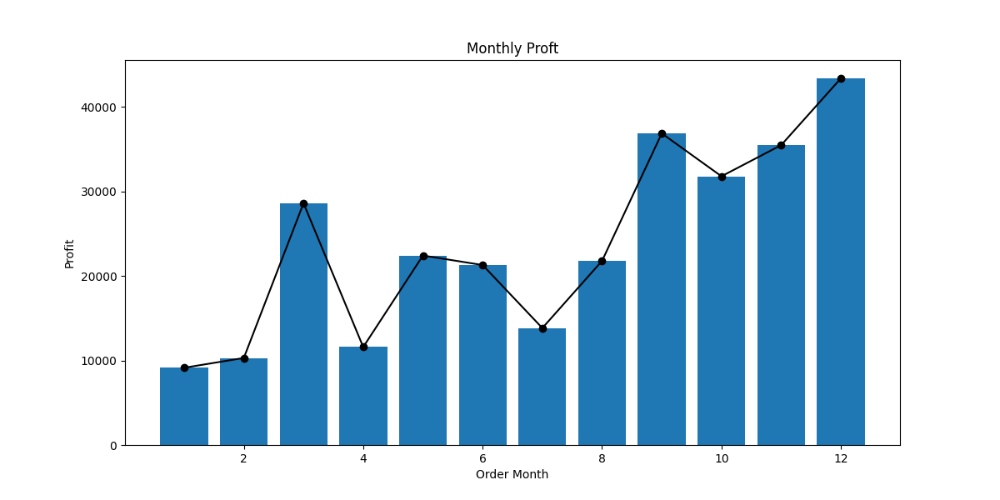
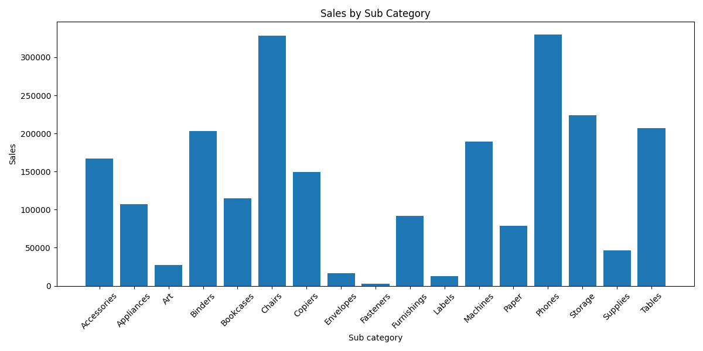
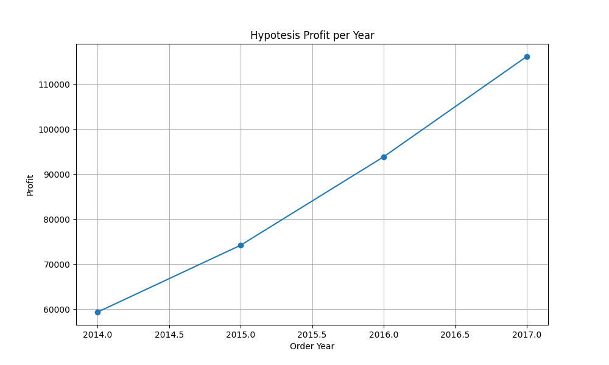

An analysis of a sales data set using the pandas library and generates a series of graphs to visualize different aspects of the data.

## Description

This project focuses on analyzing sales data from a supermarket with the primary objective of identifying strengths and weaknesses to maximize profits. The aim is to gain insights into which products, regions, categories, and customer segments should be targeted or avoided, and to provide recommendations for future decision-making. 

The data set for this project is attributed to the Tableau website, and all credit goes to the original authors and creators.

This data analysis was conducted with the support and insights gained from another data analysis: [Exploratory Data Analysis on Supermarket Sales Dataset](https://medium.com/@zeeshan.haider743/exploratory-data-analysis-on-supermarket-sales-dataset-620d04a7f792)

## Getting Started

### Dependencies

The project is implemented in Python 3.11.5 without Jupyter Notebook. The project relies on the following dependencies:

* pandas version 2.1.1
* matplotlib version 3.8.0

### Installing

#### Installing the enviorement
* Download [miniconda](https://docs.conda.io/projects/miniconda/en/latest/) from the website 
* Create a new environment with Python

> Conda create --name my-env python

#### Download the dataset
* Download the [dataset](https://www.kaggle.com/datasets/vivek468/superstore-dataset-final) from Kaggle

## Data Analysis 

### First Look at the Data

The initial step is to take a closer look at the dataset.

Then, examine the data types of the values within the DataFrame.

Finally, let's review if there are any null values in the dataset.

After a quick check, we can conclude the following:

* Some data types, such as dates, may require modification before proceeding with the analysis.
* There are no null values, so there is no need to delete or fill in rows.
* We need to split the date columns into year and month.
* Create a new column for 'Profit Margin' using the following formula:

$$Profit Margin = \frac{Profit}{Sales}*100$$

### Analyzing Data

First let's visualize the trends of sales and profits in months and years.

And then over each month

From the plots, we can see that the company is profitable, and it is evident that profits have a direct correlation with sales.

#### Comparison by Category

Now, let's compare sales and profits by category and sub-category. The goal is to identify the most profitable products and the products with the highest sales volume.

By examining the sales and profit pie charts, we can observe that there are a significant number of sales in the furniture category, but there is almost no profit. Therefore, let's explore the sub-categories to analyze where the issue lies.

Now it's clearer which furniture items are not profitable, and it's evident that 'Tables,' despite having a high volume of sales, are incurring heavy losses, which is why the overall furniture profit is low.

#### Comparison by Product

Next, let's identify the most and least profitable products of the company.

From the plot, we can clearly see that there are some products that are incredibly profitable while others are not.

#### Comparison by Regions

Now, lets check which stores are the most profitables

We can observe that all four regions have experienced growth in sales, but the South and Central regions appear to have comparatively lower profits.

#### Comparison by States

Finally, let's perform a quick check of the profits in the states.

### Formulating a hypothesis

Now that we have this information, we can formulate a hypothesis. We can consider discontinuing the least profitable products to minimize losses. Furthermore, by using the Profit Margin, we can identify and potentially remove an additional 30 products to enhance overall profitability.

plots to visualize the results by year and illustrate the differences.

Following the hypothesis, we can observe a difference of 20,000 units in profit, which signifies a 20 percent increase in profitability.

### Recommendations:

* It's advisable to suspend the sale of products that are not contributing significantly to the company's profits in future operations.
* A careful examination of the furniture department is necessary to address the substantial losses in its sales.
* The company should prioritize regions and states that are experiencing profit growth while addressing those that are generating insufficient profits.

## Authors

|Author: |Mario Eduardo Lara Loredo|
|:---: |:---:|
|date:|24/09/2023|

## Acknowledgments

* [Exploratory Data Analysis on Supermarket Sales Dataset](https://medium.com/@zeeshan.haider743/exploratory-data-analysis-on-supermarket-sales-dataset-620d04a7f792)
* [Superstore Dataset](https://www.kaggle.com/datasets/vivek468/superstore-dataset-final)